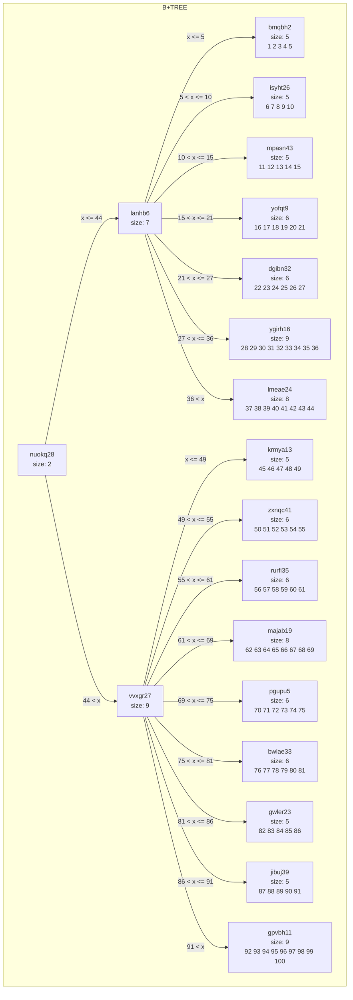

```mermaid
graph TD
subgraph B+TREE
nuokq28[nuokq28<br/>size: 2<br/>]
lanhb6[lanhb6<br/>size: 7<br/>]
bmqbh2[bmqbh2<br/>size: 5<br/>1 2 3 4 5 ]
lanhb6-->|x <= 5|bmqbh2
isyht26[isyht26<br/>size: 5<br/>6 7 8 9 10 ]
lanhb6-->|5 < x <= 10|isyht26
mpasn43[mpasn43<br/>size: 5<br/>11 12 13 14 15 ]
lanhb6-->|10 < x <= 15|mpasn43
yofqt9[yofqt9<br/>size: 6<br/>16 17 18 19 20 21 ]
lanhb6-->|15 < x <= 21|yofqt9
dgibn32[dgibn32<br/>size: 6<br/>22 23 24 25 26 27 ]
lanhb6-->|21 < x <= 27|dgibn32
ygirh16[ygirh16<br/>size: 9<br/>28 29 30 31 32 33 34 35 36 ]
lanhb6-->|27 < x <= 36|ygirh16
lmeae24[lmeae24<br/>size: 8<br/>37 38 39 40 41 42 43 44 ]
lanhb6-->|36 < x|lmeae24
nuokq28-->|x <= 44|lanhb6
vvxgr27[vvxgr27<br/>size: 9<br/>]
krmya13[krmya13<br/>size: 5<br/>45 46 47 48 49 ]
vvxgr27-->|x <= 49|krmya13
zxnqc41[zxnqc41<br/>size: 6<br/>50 51 52 53 54 55 ]
vvxgr27-->|49 < x <= 55|zxnqc41
rurfi35[rurfi35<br/>size: 6<br/>56 57 58 59 60 61 ]
vvxgr27-->|55 < x <= 61|rurfi35
majab19[majab19<br/>size: 8<br/>62 63 64 65 66 67 68 69 ]
vvxgr27-->|61 < x <= 69|majab19
pgupu5[pgupu5<br/>size: 6<br/>70 71 72 73 74 75 ]
vvxgr27-->|69 < x <= 75|pgupu5
bwlae33[bwlae33<br/>size: 6<br/>76 77 78 79 80 81 ]
vvxgr27-->|75 < x <= 81|bwlae33
gwler23[gwler23<br/>size: 5<br/>82 83 84 85 86 ]
vvxgr27-->|81 < x <= 86|gwler23
jibuj39[jibuj39<br/>size: 5<br/>87 88 89 90 91 ]
vvxgr27-->|86 < x <= 91|jibuj39
gpvbh11[gpvbh11<br/>size: 9<br/>92 93 94 95 96 97 98 99 100 ]
vvxgr27-->|91 < x|gpvbh11
nuokq28-->|44 < x|vvxgr27
end
```

```mermaid
graph LR
subgraph UNORDERED_HEAP
nwlrb1[nwlrb1<br/>size: 4<br/>1 12 81 97 ]
smqfq3[smqfq3<br/>size: 4<br/>68 96 70 69 ]
nwlrb1-->smqfq3
mvcko4[mvcko4<br/>size: 4<br/>90 3 19 44 ]
smqfq3-->mvcko4
mqoju7[mqoju7<br/>size: 4<br/>95 99 4 32 ]
mvcko4-->mqoju7
tkdvr8[tkdvr8<br/>size: 4<br/>15 91 85 57 ]
mqoju7-->tkdvr8
wdqap10[wdqap10<br/>size: 4<br/>100 17 83 61 ]
tkdvr8-->wdqap10
qojdv12[qojdv12<br/>size: 4<br/>40 66 30 47 ]
wdqap10-->qojdv12
iumnr14[iumnr14<br/>size: 4<br/>25 59 27 41 ]
qojdv12-->iumnr14
flfkd15[flfkd15<br/>size: 4<br/>13 6 21 23 ]
iumnr14-->flfkd15
xxyvy17[xxyvy17<br/>size: 4<br/>62 72 63 93 ]
flfkd15-->xxyvy17
hnpqs18[hnpqs18<br/>size: 4<br/>60 35 26 87 ]
xxyvy17-->hnpqs18
lixzv20[lixzv20<br/>size: 4<br/>20 2 42 77 ]
hnpqs18-->lixzv20
oeiuo21[oeiuo21<br/>size: 4<br/>16 37 46 9 ]
lixzv20-->oeiuo21
ouxwl22[ouxwl22<br/>size: 4<br/>31 74 36 39 ]
oeiuo21-->ouxwl22
wnfhn25[wnfhn25<br/>size: 4<br/>75 5 82 80 ]
ouxwl22-->wnfhn25
bqmmx29[bqmmx29<br/>size: 4<br/>71 89 79 14 ]
wnfhn25-->bqmmx29
fylja30[fylja30<br/>size: 4<br/>38 51 65 84 ]
bqmmx29-->fylja30
phnwo31[phnwo31<br/>size: 4<br/>64 22 78 67 ]
fylja30-->phnwo31
coysy34[coysy34<br/>size: 4<br/>55 56 54 45 ]
phnwo31-->coysy34
qlibw36[qlibw36<br/>size: 4<br/>49 28 88 76 ]
coysy34-->qlibw36
jqeyp37[jqeyp37<br/>size: 4<br/>48 24 10 43 ]
qlibw36-->jqeyp37
ubvfe38[ubvfe38<br/>size: 4<br/>18 11 98 86 ]
jqeyp37-->ubvfe38
fyzgr40[fyzgr40<br/>size: 4<br/>34 52 7 50 ]
ubvfe38-->fyzgr40
vgpgh42[vgpgh42<br/>size: 4<br/>94 58 8 92 ]
fyzgr40-->vgpgh42
pmrkt44[pmrkt44<br/>size: 4<br/>33 29 73 53 ]
vgpgh42-->pmrkt44
end
```
